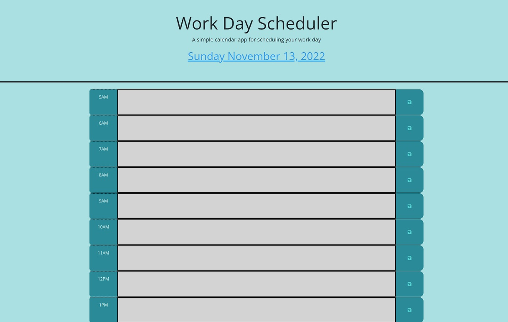

# Daily Event-Organizer

## Description

- The Daily Event Organizer is a simple tool to save events on a daily basis.

- It features a color coded queue to make the planning better.

- My main focus during this project was to use JQuery and work with code as DRY as possible.

## Technical Skills

## Table of Contents (Optional)

- [Access](#access)
- [Visuals](#visuals)
- [Credits](#credits)
- [License](#license)
- [Features](#features)
- [How to Contribute](#how-to-contribute)

## Access

- The link to my Github repository: https://github.com/EvolanGIT/Daily-Organizer
- The launched website: 

## Visuals

This is the screenshot of the full-size Quiz in full display of scoreboard, questions and timer.
    

    

## Credits

- Melany Pietrowski https://github.com/Melpie10 for all your constructive 
comments and infinite patience when a concept proves difficult to understand.

-The four Codesmen- (myself being one of)
- Edwin Pietrowski https://github.com/BogartDME
- Denart Ifurung https://github.com/difurung
- Charles Beatty https://github.com/beattycharles
- UNCC coding bootcamp TA's for all their insight and help with concepts.

## License

Copyright (c) [2022] [Yonatan Yael Bermudez Diez]

## How to Contribute

Constructive Comments are always welcome. e-mail me: yon_baermund@hotmail.com
